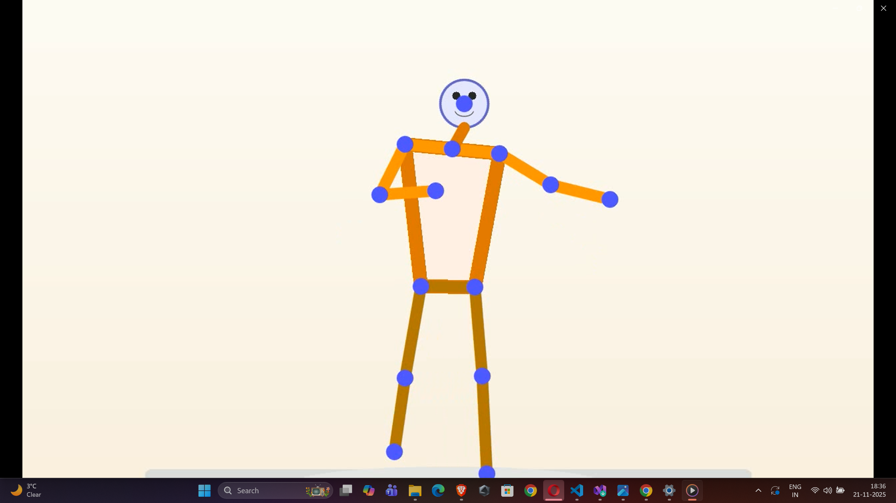

# Webcam Avatar Lab

This repository contains a small, focused **webcam avatar** application.
It uses **MediaPipe Pose** to track body landmarks from a single webcam and
renders a 2D humanoid figure that mirrors your movements in real time.

The project is designed as a concise, portfolio-ready example of using
computer vision models in a real-time application (OpenCV + MediaPipe Pose).

## Features

- Single-camera body tracking using **MediaPipe Pose**.
- Real-time **2D avatar** that mirrors:
  - Head, shoulders, elbows, wrists
  - Hips, knees, ankles
- Two synchronized views:
  - Webcam feed with skeleton overlay.
  - Clean avatar view with a stylised humanoid figure.
- Temporal smoothing to reduce jitter while staying responsive.
- Avatar is centered and scaled, so motion is shown as changes in pose rather
  than the figure sliding around the canvas.

## Demo

You can create portfolio-ready material from this project by:

- Recording a short avatar session:

  ```bash
  python webcam_avatar.py --record --output avatar_session.mp4
  ```

  and uploading `avatar_session.mp4` as a demo clip (for example in a GitHub
  release or a portfolio site).

- Capturing a screenshot of the Avatar View window and saving it as
  `assets/avatar_screenshot.png`, then referencing it here:

  ```markdown
  
  ```

This repository does not include pre-generated videos or screenshots so that it
stays lightweight. The commands above let you generate your own examples that
match your hardware and lighting.

## Setup

From the project root (this directory):

```bash
python -m venv .venv
source .venv/bin/activate      # Linux/macOS
# or on Windows
.venv\Scripts\activate

python -m pip install --upgrade pip
python -m pip install -r requirements.txt
```

This will install:

- `opencv-python`
- `mediapipe`
- `numpy`

## Usage

Run the avatar demo:

```bash
python webcam_avatar.py
```

You should see two windows:

- **Webcam View**: your live camera with a skeleton drawn on your body.
- **Avatar View**: a stylised stick-figure humanoid that mirrors your pose.

Controls:

- `q` - quit both windows.

Tips for best results:

- Make sure your upper body and, if possible, your legs are fully visible in
  the webcam frame.
- Stand at a consistent distance from the camera.
- Avoid very fast, abrupt movements if you want the avatar to look smooth.

### Recording the avatar

To save the Avatar View to a video file while it tracks your movements:

```bash
python webcam_avatar.py --record --output avatar_session.mp4
```

This records only the **Avatar View** window to the specified output file
(`avatar_session.mp4` by default if `--output` is not provided).

## How it works (high level)

1. Each frame, the script grabs an image from your webcam.
2. MediaPipe Pose runs a neural network to detect 3D body landmarks.
3. We select key joints (head, shoulders, elbows, wrists, hips, knees, ankles)
   and convert them into 2D coordinates.
4. A small smoothing filter is applied over time so joints do not jitter.
5. The avatar view is drawn by:
   - Centering on your hip position.
   - Scaling and drawing lines between joints to form a stick-figure.

There is no training loop in this project. All "intelligence" comes from the
pre-trained pose estimator, while the avatar rendering and smoothing are kept
simple and deterministic so the behaviour is easy to understand and extend.
